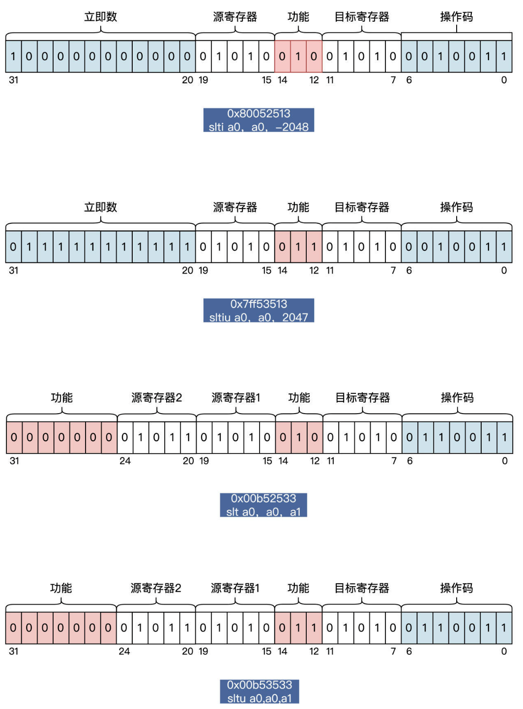
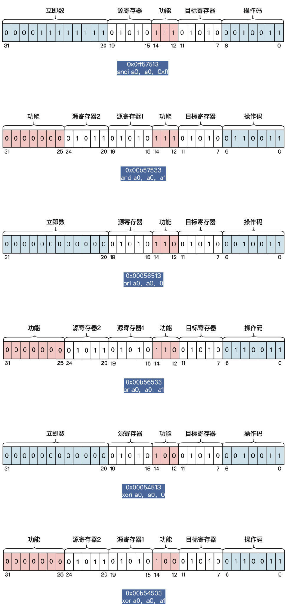
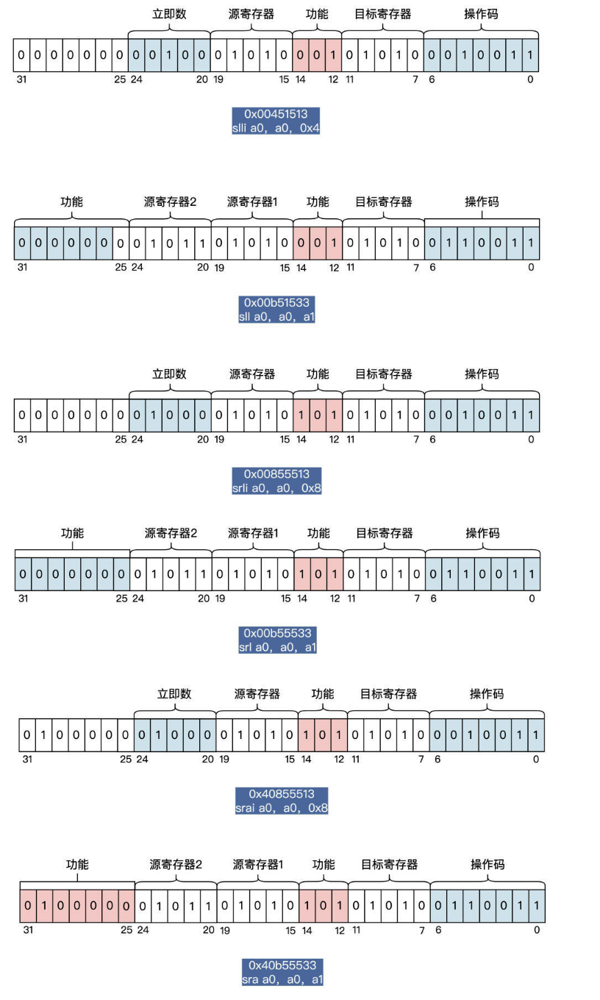
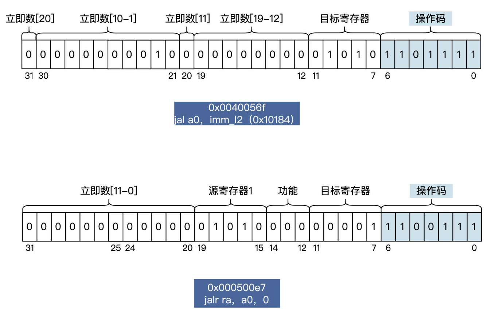
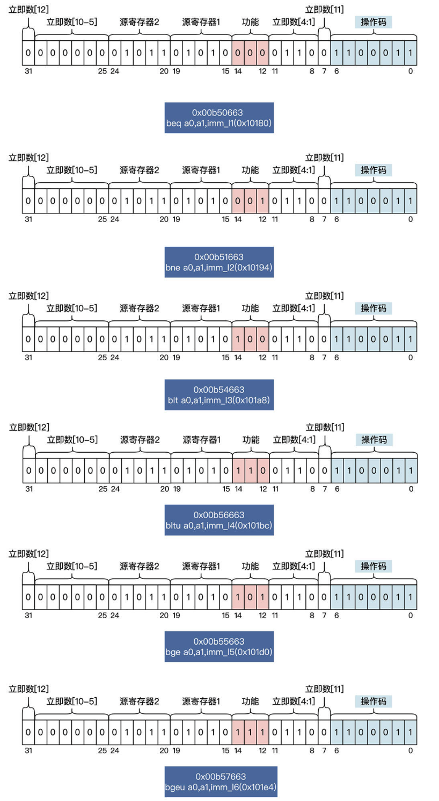

# riscv-asm-init
## 环境搭建
> **机器选择：**[Deepin](https://mirrors.aliyun.com/deepin-cd/23-nightly/deepin-desktop-community-23-nightly-amd64.iso?spm=a2c6h.25603864.0.0.5b9922a8FpaOsD)
```shell
# 安装依赖
sudo apt-get upgrade

sudo apt-get install git autoconf automake autotools-dev \
curl python3 libmpc-dev libmpfr-dev libgmp-dev gawk build-essential \
bison flex texinfo gperf patchutils bc libexpat-dev libglib2.0-dev ninja-build \
zlib1g-dev pkg-config libboost-all-dev libtool libssl-dev libpixman-1-dev \
libpython2-dev virtualenv libmount-dev libsdl2-dev

# 安装交叉编译器
git clone https://github.com/riscv-collab/riscv-gnu-toolchain

cd riscv-gnu-toolchain
mkdir build & cd build
../configure --prefix=/opt/riscv/gcc --enable-multilib --target=riscv64-multlib-elf
## –prefix表示RISC-V的工具链的安装目录
## –enable-multilib表示使用multlib库，使用该库编译出的RISC-V工具链，
##        既可以生成RISCV32的可执行程序，也可以生成RISCV64的可执行程序，
##        而默认的Newlib库则不行，它只能生成RISCV（32/64）其中之一的可执行程序。
## –target表示生成的RISC-V工具链中，软件名称的前缀是riscv64-multlib-elf-xxxx

sudo make -j8
## --- 交叉编译工具安装完成

# 安装Qemu
wget https://download.qemu.org/qemu-6.2.0.tar.xz
tar xvJf qemu-6.2.0.tar.xz
mkdir build #建立build目录
cd build #切换到build目录下

../configure --prefix=/opt/riscv/qemu --enable-sdl --enable-tools --enable-debug \
--target-list=riscv32-softmmu,riscv64-softmmu,riscv32-linux-user,riscv64-linux-user

sudo make -j8
sudo make install

#在.bashrc文件末尾加入如下信息
export PATH=/opt/riscv/gcc/bin:$PATH
export PATH=/opt/riscv/qemu/bin:$PATH
```
## 寄存器
| Register | ABI Name | Description               | Mark |     | Register  | ABI Name | Description               | Mark |
| -------- | -------- | ------------------------- | ---- | --- | --------- | -------- | ------------------------- | ---- |
| x0       | zero     | Hardwired zero            |      |     | x10       | a0       | Function arg / Return val |      |
| x1       | ra       | Return address            |      |     | x11       | a1       | Function arg / Return val |      |
| x2       | sp       | Stack pointer             |      |     | x12       | a2       | Function arg              |      |
| x3       | gp       | Global pointer            |      |     | x13       | a3       | Function arg              |      |
| x4       | tp       | Thread pointer            |      |     | x14       | a4       | Function arg              |      |
| x5       | t0       | Temp                      |      |     | x15       | a5       | Function arg              |      |
| x6       | t1       | Temp                      |      |     | x16       | a6       | Function arg              |      |
| x7       | t2       | Temp                      |      |     | x17       | a7       | Function arg              |      |
| x8       | s0 / fp  | Saved reg / Frame pointer | BP   |     | x18 ~ x27 | s2 ~ s11 | Saved reg                 |      |
| x9       | s1       | Saved reg                 |      |     | x28 ~ x31 | t3 ~ t6  | Temp                      |      |
> Extra: PC


# addi 立即数和寄存器模式
## 立即数模式
```s
addi rd, rs, imm
;addi 立即数加法指令
;rd 目标寄存器
;rs 源寄存器
;imm 立即数

;功能: rd = rs + imm
;说明：imm∈[-2048, 2047], rd/rs为通用寄存器
;如果imm超过范围，则会报错, 详情看源代码
```

由上图可以知道，imm取值范围为何是-2048~2047。寄存器33个使用5位，操作码的位数等信息。

## 寄存器模式
```s
add rd，rs1，rs2
;add 加法指令
;rd 目标寄存器
;rs1 源寄存器1
;rs2 源寄存器2;

;功能：rd = rs1 + rs2
;说明：rx为通用寄存器

sub rd, rs1, rs2
;功能：rd = rs1 - rs2
;说明：rx为通用寄存器
```


# 比较指令
## 立即数模式
```s
slti rd，rs，imm
;slti 有符号立即数比较指令
;rd 目标寄存器
;rs 源寄存器（有符号数据）
;imm 有符号立即数(-2048~2047)

sltiu rd，rs，imm
;sltiu 无符号立即数比较指令
;rd 目标寄存器
;rs 源寄存器（无符号数据）
;imm 有符号立即数(-2048~2047)

;功能：rs<imm? rd=1: rd=0
;说明：无符号中负数会转换成补码形式的正数作比较
```

## 寄存器模式
```s
slt rd，rs1，rs2
;slt 有符号比较指令
;rd 目标寄存器
;rs1 源寄存器1（有符号数据）
;rs2 源寄存器2（有符号数据）

sltu rd，rs1，rs2
;sltu 无符号比较指令
;rd 目标寄存器
;rs1 源寄存器1（无符号数据）
;rs2 源寄存器2（无符号数据）

;功能：rs1<rs2? rd=1 :rd=0
;说明：sltu中，负数会被转化成补码正数
```



# 算术指令-逻辑指令
## 立即数模式和寄存器模式
```s
; -----按位与操作-----
andi rd，rs，imm
;andi 立即数按位与指令
;rd 目标寄存器
;rs 源寄存器
;imm 立即数

and rd，rs1，rs2
;and 寄存器按位与指令
;rd 目标寄存器
;rs1 源寄存器1
;rs2 源寄存器2

; 功能：rd = rs & imm /  rd = rs1 & rs2
```
```s
; -----按位或操作-----
ori rd，rs，imm
;ori 立即数按位或指令
;rd 目标寄存器
;rs 源寄存器
;imm 立即数

or rd，rs1，rs2
;or 寄存器按位或指令
;rd 目标寄存器
;rs1 源寄存器1
;rs2 源寄存器2

; 功能：rd = rs | imm /  rd = rs1 | rs2
```
```s
; -----按位异或操作-----
xori rd，rs，imm
;xori 立即数按位异或指令
;rd 目标寄存器
;rs 源寄存器
;imm 立即数

xor rd，rs1，rs2
;xor 寄存器按位异或指令
;rd 目标寄存器
;rs1 源寄存器1
;rs2 源寄存器2

; 功能：rd = rs ^ imm /  rd = rs1 ^ rs2
```



# 算术指令-移位指令
## 立即数模式和寄存器模式
**数据在逻辑右移之后左边多出空位用0填充，而数据在算术右移之后左边多出的空位是用数据的符号位填充**
```s
; ----逻辑左移----
slli rd，rs，shamt
;slli 立即数逻辑左移指令
;rd 目标寄存器
;rs 源寄存器
;shamt 移位数，rs左移的位数，0~31

sll rd，rs1，rs2
;sll 寄存器逻辑左移指令
;rd 目标寄存器
;rs1 源寄存器1
;rs2 源寄存器2，rs1左移的位数

; ----逻辑右移----
srli rd，rs1，shamt

srl rd，rs1，rs2

; ----算术右移----
srai rd, rs, shamt

sra rd, rs1, rs2

;功能： rd = rs1 op rs2
```



# 跳转指令
## 无条件跳转指令
```s
; ----无条件跳转 立即数----
jal rd，imm
;jal 无条件的跳转并链接的指令
;rd 目标寄存器
;imm 立即数

;功能：rd = pc + 4 / pc = 符号扩展(imm<<1)

; ----无条件跳转 寄存器----
jalr rd，rs，imm
;jalr 无条件的跳转并链接的指令
;rd 目标寄存器
;rs 源寄存器
;imm 立即数

;功能：rd = pc + 4 / pc = (rs + 符号扩展(imm << 1)) & 0xfffffffe
```



## 条件跳转指令
```s
beq rs1，rs2，imm
;beq 条件相等跳转指令
;rs1 源寄存器1
;rs2 源寄存器2
;imm 立即数

;功能：if rs1==rs2 pc => imm

bne rs1，rs2，imm
;bne 条件不等跳转指令
;rs1 源寄存器1
;rs2 源寄存器2
;imm 立即数

;功能：if rs1!=rs2 pc => imm

blt rs1，rs2，imm
;blt 条件小于跳转指令
;rs1 源寄存器1
;rs2 源寄存器2
;imm 立即数

bltu rs1，rs2，imm
;bltu 无符号数条件小于跳转指令
;rs1 源寄存器1
;rs2 源寄存器2
;imm 立即数
;功能：if rs1 < rs2 pc => imm

bge rs1，rs2，imm
;bge 条件大于等于跳转指令
;rs1 源寄存器1
;rs2 源寄存器2
;imm 立即数

bgeu rs1，rs2，imm
;bgeu 无符号数条件大于等于跳转指令
;rs1 源寄存器1
;rs2 源寄存器2
;imm 立即数
;功能：if rs1 > rs2 pc => imm
```



# 原子指令
## LR/SC
```s
lr.{w/d}.{aqrl} rd，(rs)
;lr是保留加载指令
;{可选内容}W（32位）、D（64位）
;aqrl为内存顺序，一般使用默认的
;rd为目标寄存器
;rs为源寄存器
;功能：将rs->mem数据写入rd, 写入规格是w/d: 32/64 位

sc.{w/d}.{aqrl} rd，rs2，(rs1)
;sc是条件储存指令
;{可选内容}W（32位）、D（64位）
;aqrl为内存顺序，一般使用默认的
;rd为目标寄存器
;rs1为源寄存器1
;rs2为源寄存器2
;功能：将rs2写入rs1->mem, 写入规格是w/d: 32/64 位
;   如果成功则rd = 0, 否则rd = 1
```