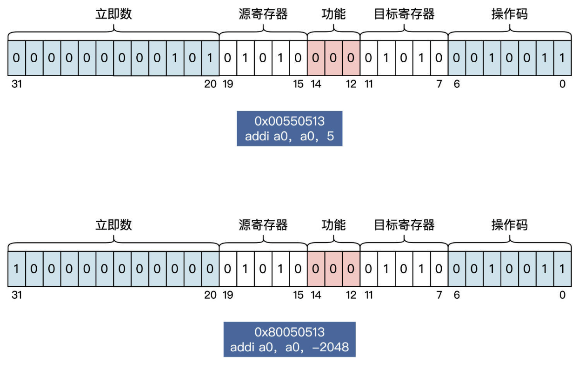
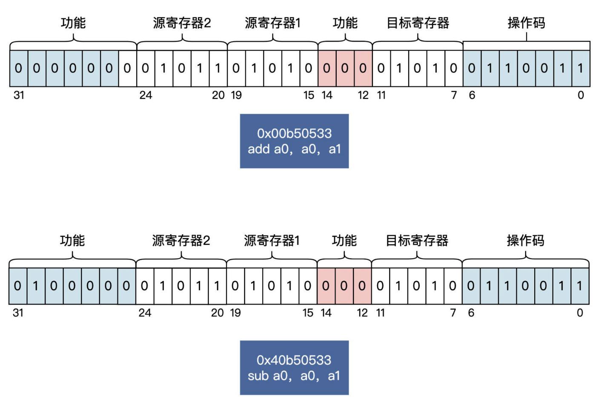

# riscv-asm-init
## 环境搭建
> **机器选择：**[Deepin](https://mirrors.aliyun.com/deepin-cd/23-nightly/deepin-desktop-community-23-nightly-amd64.iso?spm=a2c6h.25603864.0.0.5b9922a8FpaOsD)
```shell
# 安装依赖
sudo apt-get upgrade

sudo apt-get install git autoconf automake autotools-dev \
curl python3 libmpc-dev libmpfr-dev libgmp-dev gawk build-essential \
bison flex texinfo gperf patchutils bc libexpat-dev libglib2.0-dev ninja-build \
zlib1g-dev pkg-config libboost-all-dev libtool libssl-dev libpixman-1-dev \
libpython2-dev virtualenv libmount-dev libsdl2-dev

# 安装交叉编译器
git clone https://github.com/riscv-collab/riscv-gnu-toolchain

cd riscv-gnu-toolchain
mkdir build & cd build
../configure --prefix=/opt/riscv/gcc --enable-multilib --target=riscv64-multlib-elf
## –prefix表示RISC-V的工具链的安装目录
## –enable-multilib表示使用multlib库，使用该库编译出的RISC-V工具链，
##        既可以生成RISCV32的可执行程序，也可以生成RISCV64的可执行程序，
##        而默认的Newlib库则不行，它只能生成RISCV（32/64）其中之一的可执行程序。
## –target表示生成的RISC-V工具链中，软件名称的前缀是riscv64-multlib-elf-xxxx

sudo make -j8
## --- 交叉编译工具安装完成

# 安装Qemu
wget https://download.qemu.org/qemu-6.2.0.tar.xz
tar xvJf qemu-6.2.0.tar.xz
mkdir build #建立build目录
cd build #切换到build目录下

../configure --prefix=/opt/riscv/qemu --enable-sdl --enable-tools --enable-debug \
--target-list=riscv32-softmmu,riscv64-softmmu,riscv32-linux-user,riscv64-linux-user

sudo make -j8
sudo make install

#在.bashrc文件末尾加入如下信息
export PATH=/opt/riscv/gcc/bin:$PATH
export PATH=/opt/riscv/qemu/bin:$PATH
```
## 寄存器
| Register | ABI Name | Description               | Mark |     | Register  | ABI Name | Description               | Mark |
| -------- | -------- | ------------------------- | ---- | --- | --------- | -------- | ------------------------- | ---- |
| x0       | zero     | Hardwired zero            |      |     | x10       | a0       | Function arg / Return val |      |
| x1       | ra       | Return address            |      |     | x11       | a1       | Function arg / Return val |      |
| x2       | sp       | Stack pointer             |      |     | x12       | a2       | Function arg              |      |
| x3       | gp       | Global pointer            |      |     | x13       | a3       | Function arg              |      |
| x4       | tp       | Thread pointer            |      |     | x14       | a4       | Function arg              |      |
| x5       | t0       | Temp                      |      |     | x15       | a5       | Function arg              |      |
| x6       | t1       | Temp                      |      |     | x16       | a6       | Function arg              |      |
| x7       | t2       | Temp                      |      |     | x17       | a7       | Function arg              |      |
| x8       | s0 / fp  | Saved reg / Frame pointer | BP   |     | x18 ~ x27 | s2 ~ s11 | Saved reg                 |      |
| x9       | s1       | Saved reg                 |      |     | x28 ~ x31 | t3 ~ t6  | Temp                      |      |
> Extra: PC


# addi 立即数和寄存器模式
## 立即数模式
```s
addi rd, rs, imm
#addi 立即数加法指令
#rd 目标寄存器
#rs 源寄存器
#imm 立即数

#功能: rd = rs + imm
#说明：imm∈[-2048, 2047], rd/rs为通用寄存器
#如果imm超过范围，则会报错, 详情看源代码
```

由上图可以知道，imm取值范围为何是-2048~2047。寄存器33个使用5位，操作码的位数等信息。

## 寄存器模式
```s
add rd，rs1，rs2
#add 加法指令
#rd 目标寄存器
#rs1 源寄存器1
#rs2 源寄存器2

#功能：rd = rs1 + rs2
#说明：rx为通用寄存器

sub rd, rs1, rs2
#功能：rd = rs1 - rs2
#说明：rx为通用寄存器
```
